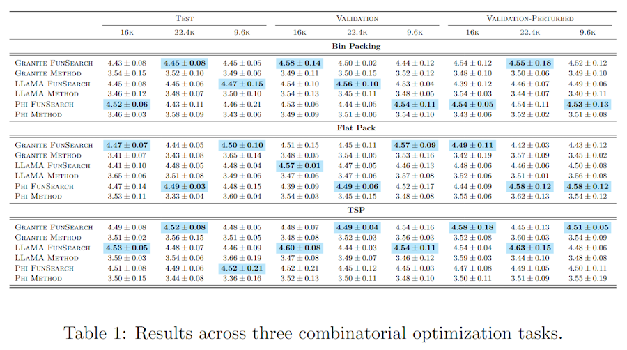

# 📄📊 Paperviz

[](https://github.com/lars-quaedvlieg/paperviz/releases)
[](LICENSE)
[](https://lars-quaedvlieg.github.io/paperviz/)
[](https://www.python.org/)
[](https://github.com/lars-quaedvlieg/paperviz)


**Paperviz** is a Python library for generating **publication-ready visualizations**, **LaTeX tables**, and **subfigure layouts** with minimal code and consistent style.
[**Check out the live docs**](https://lars-quaedvlieg.github.io/paperviz/) for examples and usage.

Built for AI/ML researchers, it's designed to make NeurIPS/ICLR/CVPR-style figures effortless — no more LaTeX hacks and style mismatches. Focus on your results, not your rendering.

If you use Paperviz in your research, please consider citing it using:
```bibtex
@software{quaedvlieg2025paperviz,
  author = {Quaedvlieg, Lars},
  license = {MIT},
  month = apr,
  title = {{Paperviz: Publication-ready plots and LaTeX tables for ML papers}},
  url = {https://github.com/lars-quaedvlieg/paperviz},
  version = {0.1.0},
  year = {2025}
}
```

---

## 🚀 Features

- 🧾 Auto-generated **LaTeX tables** from your data
- 📊 One-liner **plotting functions** **[COMING SOON]**
- 🧩 Easy **layout builders** for stacked, grid, and subfigure formats **[COMING SOON]**
- 📚 Expanding **Jupyter Book** documentation with live examples **[COMING SOON]**

---

## 📦 Installation

```bash
git clone git@github.com:lars-quaedvlieg/paperviz.git paperviz
cd paperviz
pip install .
```

(Coming soon to PyPI)

---

## 🧪 Examples

**Multi-level table example:**
```python
from paperviz.table import table

complex_df = ...

latex_string = table(
    "results_multilevel_latex",
    df=complex_df,
    row_index="Model",
    col_index=["Split", "Budget"],
    groupby="Task",
    value_column="score",
    highlight="min",
    stderr=True,
    caption="Combinatorial optimization results",
    label="tab:combo_results"
)
```


---

## 📁 Project Structure

| Module       | Description                                                     |
|--------------|-----------------------------------------------------------------|
| `paperviz.table`  | Table generators                                                |
| `paperviz.plot`   | [COMING SOON] Plotting utilities built on Seaborn & Matplotlib  |
| `paperviz.layout` | [COMING SOON] Layout builders for stacked / side-by-side images |
| `paperviz.utils`  | [COMING SOON] Formatters, LaTeX helpers, config exporters       |

---

## 🛠️ Roadmap

- [ ] Add plot types (confusion, UMAP, attention, histograms, etc.)
- [ ] W&B / MLflow integration
- [ ] More...

---

## 🤝 Contributing

Contributions are very welcome! See `CONTRIBUTING.md` for setup and module structure.

---
