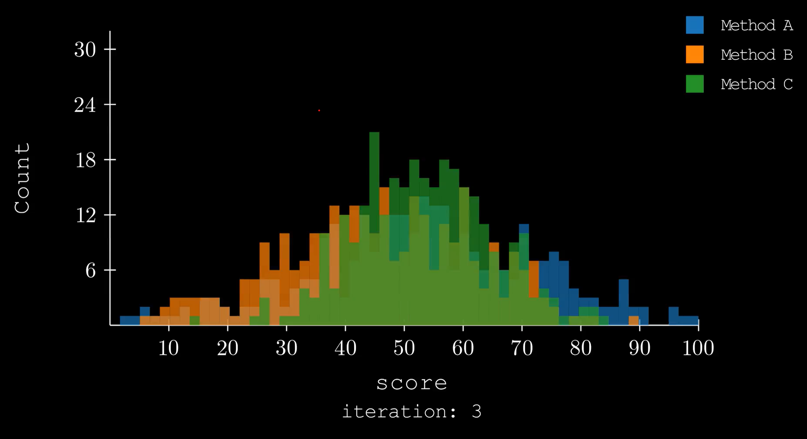
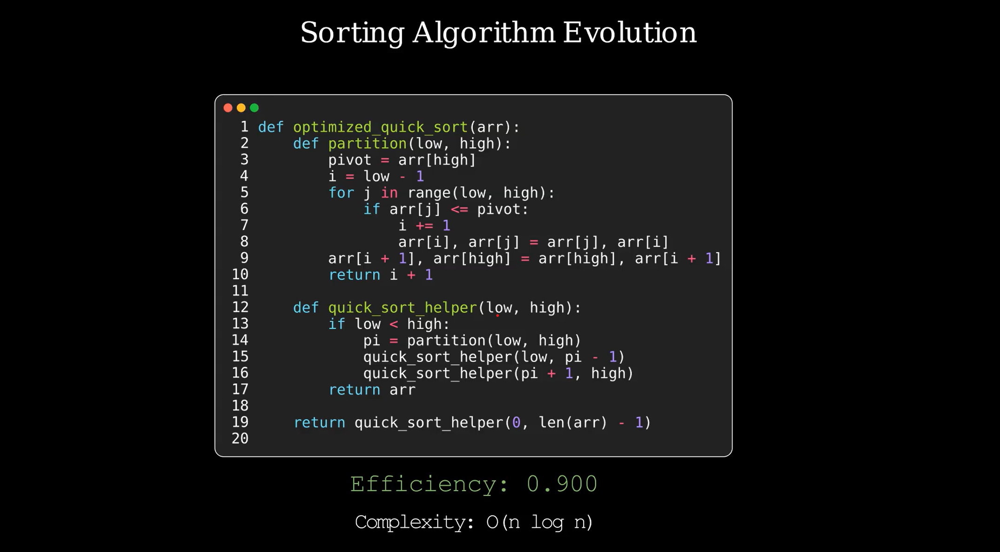

# 🎬 Manim Animations

Welcome to the Manim animations section! Here you'll find a collection of pre-built animations for visualizing code evolution, algorithms, and more. Each animation is designed to be easily customizable and ready to use in your presentations or documentation.

## 🎥 Available Animations

Browse our collection of Manim animations below. Click on any preview to see detailed usage instructions and examples.

The Manim renderer provides extensive configuration options for customizing your animations. For advanced settings, refer to the [Manim documentation](https://docs.manim.community/en/stable/reference/manim._config.utils.ManimConfig.html).

  

    
  

  <h4 style="margin: 0.5rem 0;"><a href="collection/histograms_evolution.html">histograms_evolution</a></h4>
  
Visualizes the evolution of histograms

  

    
  

  <h4 style="margin: 0.5rem 0;"><a href="collection/code_evolution.html">code_evolution</a></h4>
  
Visualizes the evolution of code versions with their optimality scores

