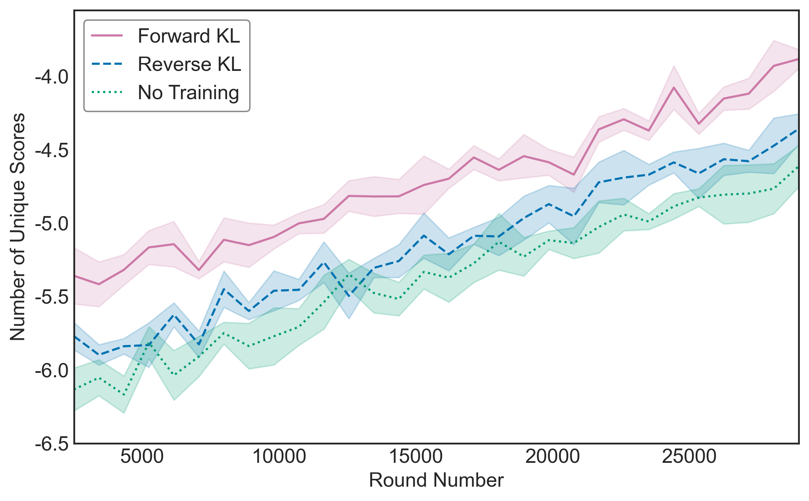
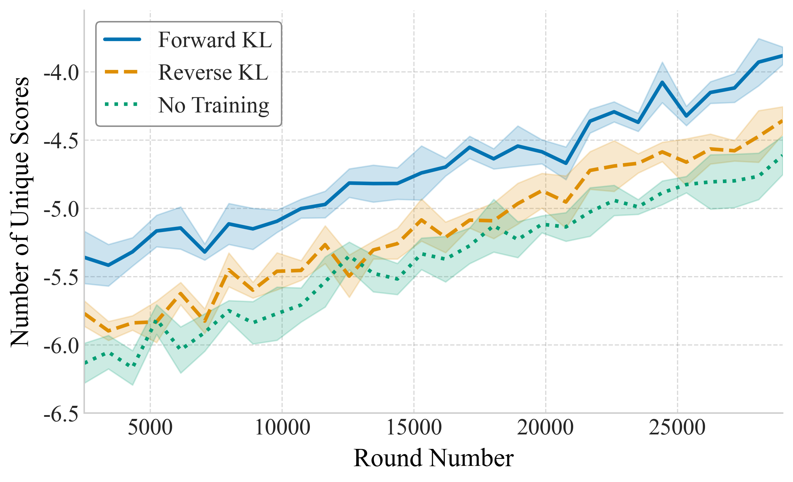
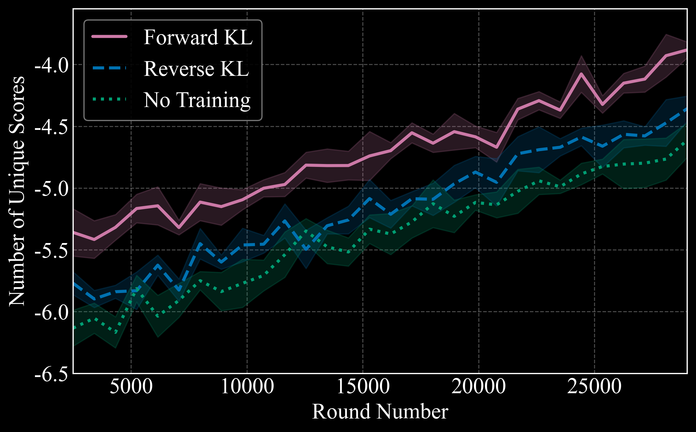

# 🎨 Themes Overview

Swizz comes with built-in visual themes for plots, inspired by common publication styles, or dark-mode aesthetics.

Each theme controls global plot styling:
- Font and font size
- Gridlines
- Color palette
- Line thickness
- Layout spacing and more

---

## ⚙️ How to use a theme

Use `set_style` to apply a theme globally to all plots:

```python
from swizz.plot.base import set_style

# Apply a theme
set_style("latex")  # This is actually the default theme

# Optionally override specific parameters
set_style("dark_latex", font_size=20, linewidth=3)
```

You can override any valid `matplotlib.rcParams` using keyword arguments.

👉 Full list of overridable params:  
[matplotlib.rcParams reference](https://matplotlib.org/stable/api/matplotlib_configuration_api.html#matplotlib.rcParams)

---

## 🖼 Theme Previews

Browse available themes below. All plots use the same data for visual consistency.

<div style="display: flex; flex-wrap: wrap; gap: 2rem; justify-content: flex-start;">
<div style="flex: 1 1 300px; max-width: 300px; border: 1px solid #ddd; padding: 1rem; border-radius: 0.5rem;">
  <div style="height: 180px; display: flex; align-items: center; justify-content: center; overflow: hidden; padding: 0.5rem;">
    <a href="">
      
    </a>
  </div>
  <h4 style="margin: 0.5rem 0;">nature</h4>
  <p style="font-size: 0.9rem;"></p>
</div>

<div style="flex: 1 1 300px; max-width: 300px; border: 1px solid #ddd; padding: 1rem; border-radius: 0.5rem;">
  <div style="height: 180px; display: flex; align-items: center; justify-content: center; overflow: hidden; padding: 0.5rem;">
    <a href="">
      
    </a>
  </div>
  <h4 style="margin: 0.5rem 0;">latex</h4>
  <p style="font-size: 0.9rem;"></p>
</div>

<div style="flex: 1 1 300px; max-width: 300px; border: 1px solid #ddd; padding: 1rem; border-radius: 0.5rem;">
  <div style="height: 180px; display: flex; align-items: center; justify-content: center; overflow: hidden; padding: 0.5rem;">
    <a href="">
      
    </a>
  </div>
  <h4 style="margin: 0.5rem 0;">dark_latex</h4>
  <p style="font-size: 0.9rem;"></p>
</div>

</div>
