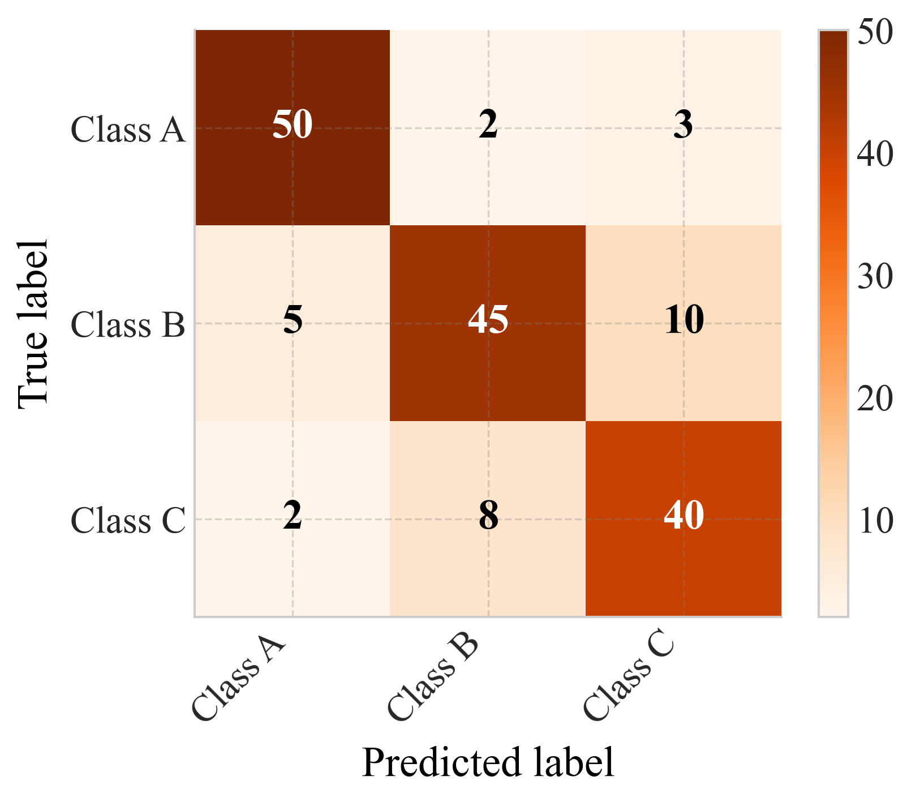

# `confusion_matrix`

> Plot a confusion matrix heatmap with optional normalization and annotations.

---

## 📥 Arguments

| Name | Type | Required | Description |
|------|------|----------|-------------|
| cm | np.ndarray | ✅ | Confusion matrix as a 2D numpy array (shape N×N). |
| labels | List[str] | ✅ | List of class labels, length N, corresponding to matrix indices. |
| figsize | tuple | ❌ | Figure size, e.g., (8, 6). |
| cmap | str | ❌ | Matplotlib colormap name, e.g., 'Blues'. |
| normalize | bool | ❌ | If True, normalize rows to sum to 1 before plotting. |
| title | str | ❌ | Optional title for the plot. |
| fmt | str | ❌ | Format string for annotations, e.g., 'd' or '.2f'. |
| cbar | bool | ❌ | Whether to display the colorbar. |
| save | str | ❌ | Base filename to save PNG and PDF outputs. |

---

## 📦 Example Output

````{dropdown} Click to show example code
```python
import numpy as np
import matplotlib.pyplot as plt
from swizz import plot

# 1) Define a toy confusion matrix
#    Rows = true classes, Columns = predicted classes
cm = np.array([
    [50,  2,  3],
    [ 5, 45, 10],
    [ 2,  8, 40],
])

# 2) Class labels
labels = ["Class A", "Class B", "Class C"]

# 3) Plot raw counts
fig1, ax1 = plot(
    "confusion_matrix",
    cm=cm,
    labels=labels,
    figsize=(6, 5),
    cmap="Oranges",
    normalize=False,
    fmt="d",
    cbar=True,
    save="confusion_matrix_raw"
)
plt.show()

```
````


