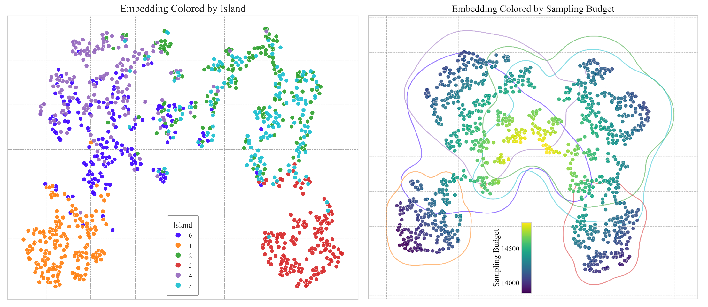

# `embedding_2d_plot`

> Plot a 2D embedding (e.g., t-SNE, PCA, UMAP) colored by categorical groups or continuous values, with optional density contours, legends, and colorbars.

---

## 📥 Arguments

| Name | Type | Required | Description |
|------|------|----------|-------------|
| df | pd.DataFrame | ✅ | DataFrame containing at least 'x', 'y', and the hue column. |
| font_family | str | ❌ | Font family for title, legend, and colorbar. Default: 'Times New Roman'. |
| title | str | ❌ | Title for the plot. Default: None. |
| mode | str | ❌ | Plotting mode: 'categorical' or 'continuous'. Default: 'categorical'. |
| hue_column | str | ❌ | Column name for coloring points. Must be provided. |
| palette | List[str] | ❌ | List of colors for categorical groups. If None, uses seaborn 'tab20' palette. |
| cmap_continuous | str | ❌ | Matplotlib colormap name for continuous values. Default: 'viridis'. |
| display_legend | bool | ❌ | Whether to display the legend (categorical mode only). Default: False. |
| legend_loc | str | ❌ | Legend location if displayed. Default: 'lower right'. |
| display_cbar | bool | ❌ | Whether to display the colorbar (continuous mode only). Default: False. |
| cbar_loc | str | ❌ | Colorbar inset location if displayed. Default: 'lower right'. |
| show_density | bool | ❌ | Whether to overlay density contours (continuous mode only). Default: False. |
| density_column | str | ❌ | Column to use for density grouping. Default: 'island' if exists. |
| density_alpha | float | ❌ | Transparency for density contours. Default: 0.5. |
| figsize | tuple | ❌ | Figure size in inches. Default: (8, 8). |
| s | int | ❌ | Marker size for scatter points. Default: 40. |
| alpha | float | ❌ | Transparency for scatter points. Default: 0.9. |
| edgecolor | str | ❌ | Edge color for scatter points. Default: 'white'. |
| linewidth | float | ❌ | Edge line width for scatter points. Default: 0.3. |
| save | str | ❌ | Base filename to save PNG and PDF versions if provided. |

---

## 📦 Example Output

````{dropdown} Click to show example code
```python
import numpy as np
from matplotlib import pyplot as plt
import pandas as pd
from sklearn.datasets import make_blobs
from sklearn.manifold import TSNE
from paperviz import plot

# 1. Create clustered data
X, y = make_blobs(
    n_samples=1000,
    centers=6,
    cluster_std=2.2,  # Small but not tiny std: they overlap a little
    random_state=43
)

# Add tiny noise
X += np.random.normal(0, 0.5, X.shape)

# 1.2. Apply t-SNE
X_embedded = TSNE(n_components=2, random_state=42, perplexity=30).fit_transform(X)

# 1.3. Build structured sampling budget (just for example to make a case for the continuous example)
sampling_budget = 15000 - 4000 * np.tanh(np.linalg.norm(X_embedded, axis=1) / 150)

df = pd.DataFrame({
    "x": X_embedded[:, 0],
    "y": X_embedded[:, 1],
    "Island": y,
    "Sampling Budget": sampling_budget
})

# ---- 2. Plot: Categorical Mode (Island Coloring) ----

plot("embedding_2d_plot",
     df=df,
     mode="categorical",
     hue_column="Island",
     title="Embedding Colored by Island",
     display_legend=True,
     palette=[
         "#3b00ff", "#ff7f0e", "#2ca02c",
         "#d62728", "#9467bd", "#17becf"
     ],
     legend_loc="lower center",
     )
plt.show()

# ---- 3. Plot: Continuous Mode (Sampling Budget Coloring) ----

plot("embedding_2d_plot",
     df=df,
     mode="continuous",
     hue_column="Sampling Budget",
     density_column="Island",
     title="Embedding Colored by Sampling Budget",
     show_density=True,
     display_cbar=True,
     palette=[
         "#3b00ff", "#ff7f0e", "#2ca02c",
         "#d62728", "#9467bd", "#17becf"
     ],
     cbar_loc="lower center",
     )
plt.show()

```
````


