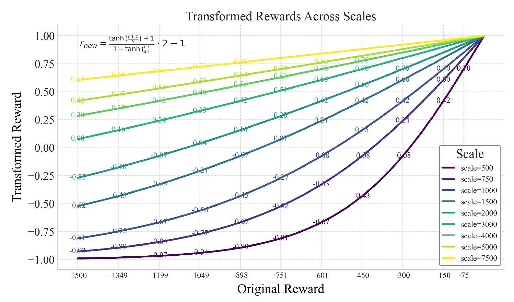

# `function_percentile_plot`

> Plot any function curve across x-values, grouped by a variable (e.g., scale), with percentile annotations and optional formula text.

---

## 📥 Arguments

| Name | Type | Required | Description |
|------|------|----------|-------------|
| df | pd.DataFrame | ✅ | DataFrame containing 'x', 'y', and 'group' columns. |
| xlabel | str | ❌ | Label for the x-axis. Default: 'X'. |
| ylabel | str | ❌ | Label for the y-axis. Default: 'Y'. |
| title | str | ❌ | Title for the plot. Default: 'Function Curve with Percentile Labels'. |
| legend_title | str | ❌ | Title of the legend. Default: None. |
| func_loc | str | ❌ | The location of the function text (if not None). Default: 'top left'. |
| legend_loc | str | ❌ | The location of the legend (if not None). Default: 'lower right'. |
| cmap | str | ❌ | The color map of the lines. Default: 'viridis'. |
| hline_at | float | ❌ | Draw a horizontal line at this y-value. Default: None. |
| function_str | str | ❌ | Optional LaTeX string to annotate function formula. |
| function_str_coords | Tuple[float, float] | ❌ | Coordinates for the function string annotation in Axes coordinates. Default: (0.05, 0.96). |
| function_font_size | int | ❌ | Font size for function string annotation. Default: 13. |
| numbers_font_size | int | ❌ | Font size for percentile number annotations. Default: 11. |
| figsize | tuple | ❌ | Figure size. Default: (10, 6). |
| min_label_val | float | ❌ | Minimum y-value to annotate labels. Default: -inf. |
| max_label_val | float | ❌ | Maximum y-value to annotate labels. Default: inf. |
| percentiles | List[int] | ❌ | Percentiles to compute for labels. Default: [0,10,20,...,90,95]. |
| save | str | ❌ | Base filename to save PNG and PDF if provided. |

---

## 📦 Example Output

````{dropdown} Click to show example code
```python
import numpy as np
from matplotlib import pyplot as plt
import pandas as pd
from paperviz import plot, set_style

# Example function
transform_full = lambda r, c, s: ((np.tanh((r + c) / s) + 1) / (1 + np.tanh(c / s))) * 2 - 1
transform = lambda r, s: transform_full(r, 0, s)

# Generate Data
failed_reward, max_reward = -1500, 0
scores = np.linspace(failed_reward, max_reward, 500)

reward_scales = [500, 750, 1000, 1500, 2000, 3000, 4000, 5000, 7500]

data = []
for scale in reward_scales:
    transformed_scores = transform(scores, scale)
    for x, y in zip(scores, transformed_scores):
        data.append({'x': x, 'y': y, 'group': f'scale={scale}'})

df = pd.DataFrame(data)

# Call the plot method
fig, ax = plot("function_percentile_plot",
    df,
    xlabel="Original Reward",
    ylabel="Transformed Reward",
    title="Transformed Rewards Across Scales",
    cmap="viridis",
    legend_title="Scale",
    min_label_val=-0.98,
    max_label_val=0.8,
    function_str=r'$r_{new} = \frac{\tanh\left(\frac{r + c}{s}\right) + 1}{1 + \tanh\left(\frac{c}{s}\right)} \cdot 2 - 1$',
)
plt.show()
```
````


