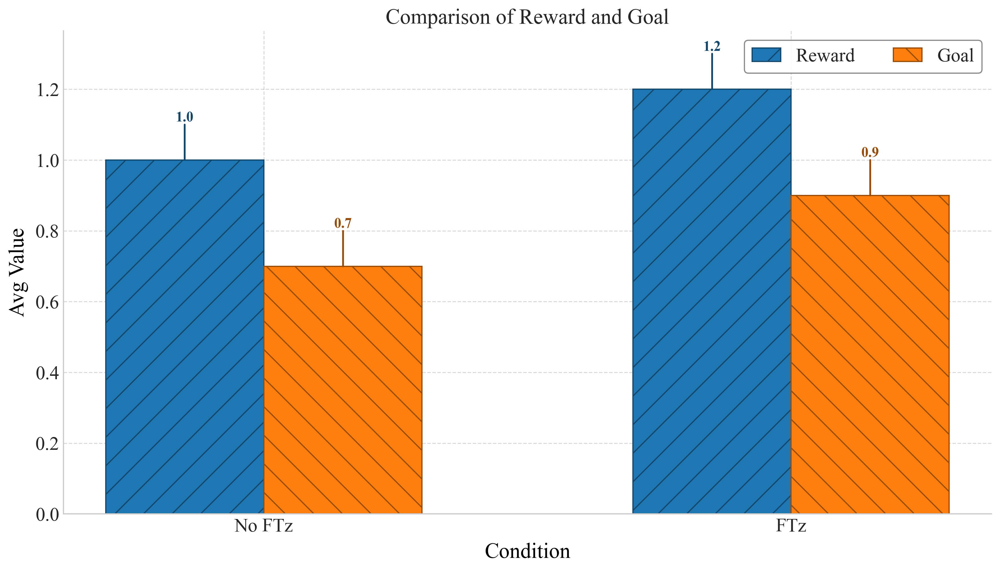

# `general_bar_plot`

> General bar plot comparing multiple metrics for each category with consistent colors and hatching.

---

## 📥 Arguments

| Name | Type | Required | Description |
|------|------|----------|-------------|
| df | pd.DataFrame | ✅ | DataFrame containing the category column and one or more metric columns. |
| category_column | str | ✅ | Column name for the x-axis categories (e.g., 'Group', 'Condition'). |
| figsize | tuple | ❌ | Figure size. Default: (12, 7). |
| xlabel | str | ❌ | Label for x-axis. |
| ylabel | str | ❌ | Label for y-axis. |
| title | str | ❌ | Title of the plot. |
| legend_loc | str | ❌ | Legend location. Default: 'upper right'. |
| bar_width | float | ❌ | Width of bars. Default: 0.25. |
| color_map | Dict[str, str] | ❌ | Map from metric name to color. |
| style_map | Dict[str, str] | ❌ | Map from metric name to hatch style. |
| save | str | ❌ | Base filename to save PNG and PDF. |

---

## 📦 Example Output

````{dropdown} Click to show example code
```python
import pandas as pd
from swizz import plot
import matplotlib.pyplot as plt

df = pd.DataFrame({
    "Condition": ["No FTz", "FTz"],
    "Reward": [1.0, 1.2],
    "Goal": [0.7, 0.9],
})

fig, ax = plot("general_bar_plot",
    df=df,
    category_column="Condition",
    ylabel="Avg Value",
    title="Comparison of Reward and Goal",
    color_map={"Reward": "tab:blue", "Goal": "tab:orange"},
    style_map={"Reward": "/", "Goal": "\\"},
    bar_width=0.3,
    save="general_bar_plot"
)
plt.show()

```
````


