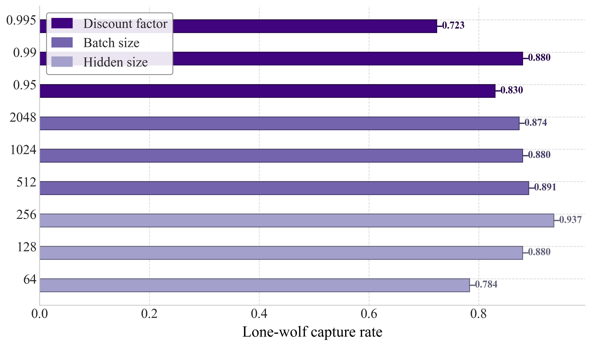

# `general_horizontal_bar_plot`

> Horizontal bar plot comparing metrics for each category, with optional group-based coloring and legends.

---

## 📥 Arguments

| Name | Type | Required | Description |
|------|------|----------|-------------|
| df | pd.DataFrame | ✅ | DataFrame with category_column and metric columns. |
| category_column | str | ✅ | Column used for y-axis labels. |
| category_group_map | Dict[str, str] | ❌ | Mapping of category name → group label (used for colour and legend). |
| group_color_map | Dict[str, str] | ❌ | Mapping of group label → colour. |
| figsize | tuple | ❌ | Figure size. Default: (12, 7). |
| xlabel | str | ❌ | Label for x-axis. |
| ylabel | str | ❌ | Label for y-axis. |
| title | str | ❌ | Title of the plot. |
| legend_loc | str | ❌ | Legend location. Default: 'upper right'. |
| bar_height | float | ❌ | Height of the bars. Default: 0.35. |
| color_map | Dict[str, str] | ❌ | Mapping of metrics to colours. |
| style_map | Dict[str, str] | ❌ | Mapping of metrics to hatch styles. |
| put_legend | bool | ❌ | Whether to display a legend. Default: True. |
| save | str | ❌ | Filename base to save PNG and PDF. |
| ax | matplotlib.axes.Axes | ❌ | Optional matplotlib Axes object. |

---

## 📦 Example Output

````{dropdown} Click to show example code
```python
import pandas as pd
import matplotlib.pyplot as plt
from swizz import plot

# 1) Prepare the data as a DataFrame
df = pd.DataFrame({
    "Category": ["64", "128", "256", "512", "1024", "2048", "0.95", "0.99", "0.995"],
    "rate": [0.7835051, 0.8800000, 0.9368421,
             0.8913044, 0.8800000, 0.8736842,
             0.8297873, 0.8800000, 0.7234042]
})

# 2) Map each category string into a group key
category_group_map = {
    "64":  "Hidden size",
    "128": "Hidden size",
    "256": "Hidden size",
    "512":  "Batch size",
    "1024": "Batch size",
    "2048": "Batch size",
    "0.95":  "Discount factor",
    "0.99":  "Discount factor",
    "0.995": "Discount factor",
}

# 3) Assign one color per group
group_color_map = {
    "Discount factor": "#41047F",
    "Batch size":      "#7464AE",
    "Hidden size":     "#A3A1CB",
}

# 4) Plot using the new function
fig, ax = plot(
    "general_horizontal_bar_plot",
    df=df,
    category_column="Category",
    category_group_map=category_group_map,
    group_color_map=group_color_map,
    xlabel="Lone-wolf capture rate",
    ylabel="",
    title="",
    bar_height=0.4,
    style_map={"rate": ""},
    put_legend=True,
    save="general_barh_plot",
    legend_loc="upper left",
)

plt.show()

```
````


