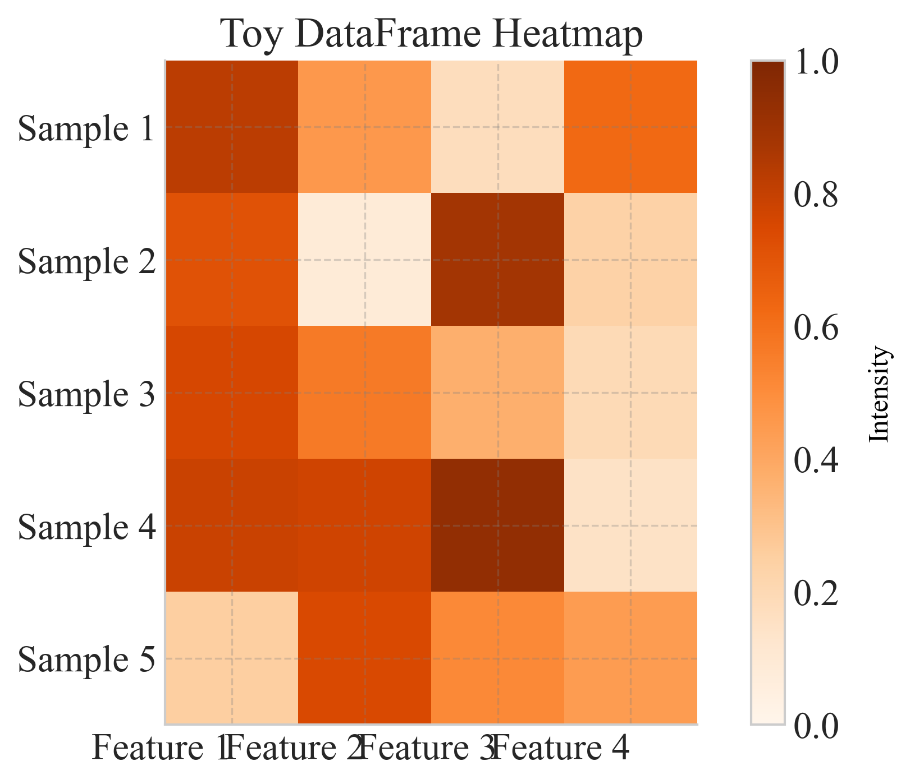

# `heatmap`

> Plot a heatmap of any pandas DataFrame with optional axis labels, annotations, and custom color-scaling.

---

## 📥 Arguments

| Name | Type | Required | Description |
|------|------|----------|-------------|
| data | pd.DataFrame | ✅ | Pandas DataFrame containing the matrix to visualize; index and columns are used as y- and x-labels by default. |
| x_labels | List[str] | ❌ | Labels for columns (overrides DataFrame columns). |
| y_labels | List[str] | ❌ | Labels for rows (overrides DataFrame index). |
| x_category | str | ❌ | Category for x-axis labels (overrides DataFrame columns). |
| y_category | str | ❌ | Category for y-axis labels (overrides DataFrame index). |
| figsize | tuple | ❌ | Figure size (width, height), e.g., (8, 6). |
| cmap | str | ❌ | Name of matplotlib colormap, e.g., 'viridis'. |
| vmin | float | ❌ | Minimum data value for color scaling. |
| vmax | float | ❌ | Maximum data value for color scaling. |
| annot | bool | ❌ | If True, overlay numeric annotations on each cell. |
| fmt | str | ❌ | Format string for annotations, e.g. '.2f' or 'd'. |
| cbar | bool | ❌ | Whether to display the colorbar. |
| title | str | ❌ | Title of the heatmap. |
| save | str | ❌ | Base filename to save PNG and PDF (without extension). |
| cbar_title | str | ❌ | Title for the colorbar. |
| ax | matplotlib.axes.Axes | ❌ | Matplotlib Axes object to plot on. If None, a new figure is created. |

---

## 📦 Example Output

````{dropdown} Click to show example code
```python
import pandas as pd
import numpy as np
import matplotlib.pyplot as plt
from swizz import plot

# 1) Create a toy DataFrame (5 rows × 4 columns)
rows = [f"Sample {i}" for i in range(1, 6)]
cols = [f"Feature {j}" for j in range(1, 5)]
data = pd.DataFrame(
    np.random.rand(5, 4),
    index=rows,
    columns=cols
)

# 2) Plot with annotations, custom colormap, and save output
fig, ax = plot(
    "heatmap",
    data=data,
    figsize=(7, 5),
    cmap="Oranges",
    vmin=0.0,
    vmax=1.0,
    annot=False,
    fmt=".2f",
    cbar=True,
    title="Toy DataFrame Heatmap",
    save="dataframe_heatmap_example"
)

# 3) Show the figure
plt.show()

```
````


