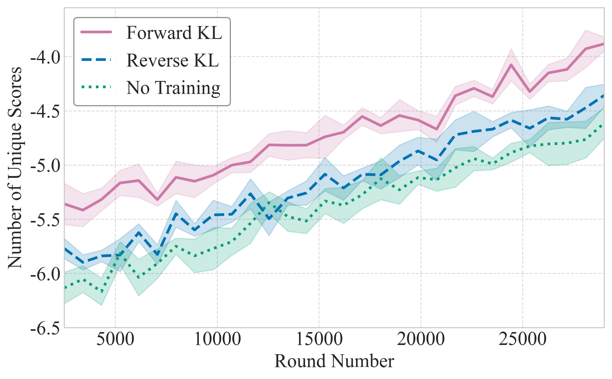

# `multiple_std_lines`

> Line plot with shaded confidence intervals and configurable label, color, and linestyle mappings.

---

## 📥 Arguments

| Name | Type | Required | Description |
|------|------|----------|-------------|
| data_dict | Dict[str, Dict[str, np.ndarray]] | ✅ | Each key is a run, and maps to a dict with arrays for x, y, and stderr. |
| x_key | str | ❌ | Key in inner dict to use for x-axis. Default: 'round_num'. |
| y_key | str | ❌ | Key in inner dict to use for y-axis. Default: 'unique_scores'. |
| yerr_key | str | ❌ | Key in inner dict for standard error values. Default: 'std_error'. |
| figsize | tuple | ❌ | The size of your figure. Default: (8, 5). |
| legend_loc | str | ❌ | The location of the legend. Default: 'upper left'. |
| label_map | Dict[str, str] | ❌ | Mapping of internal label to display name. |
| color_map | Dict[str, str] | ❌ | Mapping of label → color hex string. |
| style_map | Dict[str, str] | ❌ | Mapping of label → line style. |
| xlim | Tuple[float, float] | ❌ | X-axis limits. |
| ylim | Tuple[float, float] | ❌ | Y-axis limits. |
| xlabel | str | ❌ | X-axis label. |
| ylabel | str | ❌ | Y-axis label. |
| x_formatter | Callable | ❌ | Formatter function for x-ticks. |
| y_formatter | Callable | ❌ | Formatter function for y-ticks. |
| save | str | ❌ | Base filename to save PNG and PDF. |

---

## 📦 Example Output

````{dropdown} Click to show example code
```python
import numpy as np
from matplotlib import pyplot as plt
from swizz import plot

rounds = np.linspace(250, 2900, 30)


def fake_curve(seed, offset=0):
    np.random.seed(seed)
    base = np.linspace(-550 + offset, -400 + offset, len(rounds))
    noise = np.random.normal(0, 8, size=len(rounds))
    stderr = np.random.uniform(5, 20, size=len(rounds))
    return base + noise, stderr


averaged_metrics = {
    "forward-method": {
        "round_num": rounds,
        "unique_scores": fake_curve(0)[0],
        "std_error": fake_curve(0)[1],
    },
    "reverse-method": {
        "round_num": rounds,
        "unique_scores": fake_curve(1, -40)[0],
        "std_error": fake_curve(1)[1],
    },
    "baseline": {
        "round_num": rounds,
        "unique_scores": fake_curve(2, -60)[0],
        "std_error": fake_curve(2)[1],
    },
}

fig, ax = plot(
    "multiple_std_lines",
    data_dict=averaged_metrics,
    label_map={
        "forward-method": "Forward KL",
        "reverse-method": "Reverse KL",
        "baseline": "No Training",
    },
    style_map={
        "forward-method": "solid",
        "reverse-method": "dashed",
        "baseline": "dotted",
    },
    color_map={
        "forward-method": "#CC79A7",
        "reverse-method": "#0072B2",
        "baseline": "#009E73",
    },
    xlabel="Round Number",
    ylabel="Number of Unique Scores",
    xlim=(250, 2900),
    ylim=(-650, -355),
    x_formatter=lambda x, _: f"{x * 10:.0f}",  # Multiples the axis numbers by 10 and formats in integers
    y_formatter=lambda y, _: f"{y / 100:.1f}",  # Divides the axis number by 100 and formats up to 1 decimal
    save="ablation"  # Saves to ablation.png and ablation.pdf
)

plt.show()

```
````


