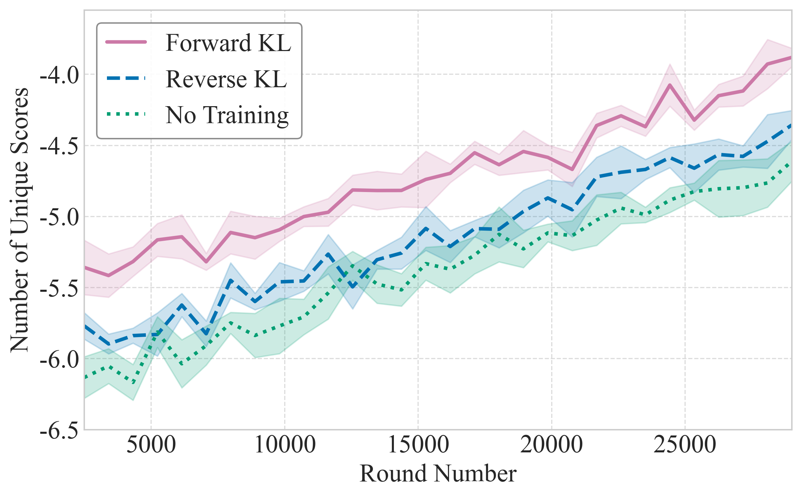

# `multiple_std_lines_df`

> Line plot with shaded confidence intervals and configurable label, color, and linestyle mappings, using a pandas DataFrame in long format.

---

## 📥 Arguments

| Name | Type | Required | Description |
|------|------|----------|-------------|
| data_df | pd.DataFrame | ✅ | Long-form DataFrame containing one row per point with columns for the run label, x values, y values, and standard error. |
| label_key | str | ✅ | Column name in data_df that identifies each run/series. |
| x_key | str | ❌ | Column name for x-axis values. Default: 'round_num'. |
| y_key | str | ❌ | Column name for y-axis values. Default: 'unique_scores'. |
| yerr_key | str | ❌ | Column name for standard error. Default: 'std_error'. |
| figsize | tuple | ❌ | Figure size. Default: (8, 5). |
| legend_loc | str | ❌ | Legend location. Default: 'upper left'. |
| legend_title | str | ❌ | Legend title. Default: None. |
| legend_ncol | int | ❌ | Number of columns in legend. Default: 1. |
| label_map | Dict[str, str] | ❌ | Mapping of raw labels to display names. |
| color_map | Dict[str, str] | ❌ | Mapping of raw labels to line colors. |
| style_map | Dict[str, str] | ❌ | Mapping of raw labels to line styles. |
| xlim | Tuple[float, float] | ❌ | X-axis limits. |
| ylim | Tuple[float, float] | ❌ | Y-axis limits. |
| xlabel | str | ❌ | X-axis label. |
| ylabel | str | ❌ | Y-axis label. |
| x_formatter | Callable | ❌ | Formatter for x-axis ticks. |
| y_formatter | Callable | ❌ | Formatter for y-axis ticks. |
| save | str | ❌ | Base filename to save PNG and PDF. |

---

## 📦 Example Output

````{dropdown} Click to show example code
```python
import numpy as np
from matplotlib import pyplot as plt
from swizz import plot
import pandas as pd 

rounds = np.linspace(250, 2900, 30)

def fake_curve(seed, offset=0):
    np.random.seed(seed)
    base = np.linspace(-550 + offset, -400 + offset, len(rounds))
    noise = np.random.normal(0, 8, size=len(rounds))
    stderr = np.random.uniform(5, 20, size=len(rounds))
    return base + noise, stderr

# Build a long-form DataFrame
records = []
for name, (seed, offset) in [("forward-method", (0, 0)), ("reverse-method", (1, -40)), ("baseline", (2, -60))]:
    y_vals, stderr_vals = fake_curve(seed, offset)
    for x_val, y_val, err in zip(rounds, y_vals, stderr_vals):
        records.append({
            "method": name,
            "round_num": x_val,
            "unique_scores": y_val,
            "std_error": err,
        })
df = pd.DataFrame.from_records(records)

# Correct call: include plot name as first argument
fig, ax = plot(
    "multiple_std_lines_df",
    df,
    label_key="method",
    label_map={
        "forward-method": "Forward KL",
        "reverse-method": "Reverse KL",
        "baseline": "No Training",
    },
    color_map={
        "forward-method": "#CC79A7",
        "reverse-method": "#0072B2",
        "baseline": "#009E73",
    },
    style_map={
        "forward-method": "solid",
        "reverse-method": "dashed",
        "baseline": "dotted",
    },
    xlabel="Round Number",
    ylabel="Number of Unique Scores",
    xlim=(250, 2900),
    ylim=(-650, -355),
    x_formatter=lambda x, _: f"{x * 10:.0f}",
    y_formatter=lambda y, _: f"{y / 100:.1f}",
    save="ablation_df"
)
plt.show()

```
````


