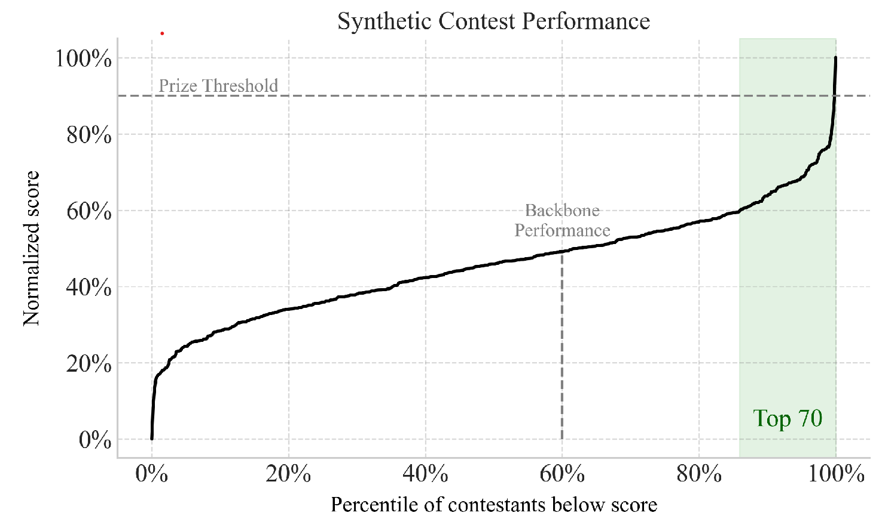

# `percentile_curve_plot`

> Plot a curve showing scores ranked by percentile, with optional normalization, vertical/horizontal marker lines, and shaded regions for top scores.

---

## 📥 Arguments

| Name | Type | Required | Description |
|------|------|----------|-------------|
| scores | np.ndarray | ✅ | Array of raw scores to plot. |
| normalize_scores | bool | ❌ | Whether to normalize scores between 0 and 1. Default: True. |
| normalize_percentiles | bool | ❌ | Whether to normalize x-axis (percentile) between 0 and 1. Default: True. |
| horizontal_markers | List[Tuple[float, str]] | ❌ | List of (y_value, label) for horizontal reference lines. |
| vertical_markers | List[Tuple[float, str]] | ❌ | List of (x_value, label) for vertical reference lines. |
| highlight_top_n | int | ❌ | Number of top scores to highlight with background shading. Default: None. |
| highlight_color | str | ❌ | Background color for the highlight region. Default: light green. |
| highlight_label | str | ❌ | Optional label to display inside the highlight area. Default: None. |
| highlight_label_color | str | ❌ | Color for the highlight label text. Default: 'green'. |
| highlight_label_font_size | int | ❌ | Font size for the highlight label text. Default: same as font_axis. |
| vertical_label_offset | float | ❌ | Vertical offset above vertical marker in axis coordinates. Default: 0.02. |
| xlabel | str | ❌ | Label for the x-axis. Default: 'Percentile'. |
| ylabel | str | ❌ | Label for the y-axis. Default: 'Score'. |
| title | str | ❌ | Title for the plot. Default: None. |
| font_family | str | ❌ | Font family for text. Default: 'Times New Roman'. |
| font_axis | int | ❌ | Font size for axis labels. Default: 14. |
| figsize | tuple | ❌ | Figure size in inches. Default: (8, 5). |
| save | str | ❌ | Base filename to save PNG and PDF if provided. |

---

## 📦 Example Output

````{dropdown} Click to show example code
```python
import numpy as np
import matplotlib.pyplot as plt
from paperviz import plot

# Generate fake scores
np.random.seed(42)
scores = np.random.normal(200, 400, size=500)

fig, ax = plot("percentile_curve_plot",
    scores=scores,
    normalize_scores=True,
    normalize_percentiles=True,
    horizontal_markers=[
        (0.9, "Prize Threshold"),
    ],
    vertical_markers=[
        (0.6, "Backbone\nPerformance"),
    ],
    highlight_top_n=70,
    highlight_label="Top 70",
    highlight_label_color="darkgreen",
    highlight_label_font_size=16,
    highlight_color="#c8e6c9",
    vertical_label_offset=0.03,
    xlabel="Percentile of contestants below score",
    ylabel="Normalized score",
    title="Synthetic Contest Performance",
    font_family="Times New Roman",
    font_axis=14,
    figsize=(8, 5),
)
plt.show()
```
````


