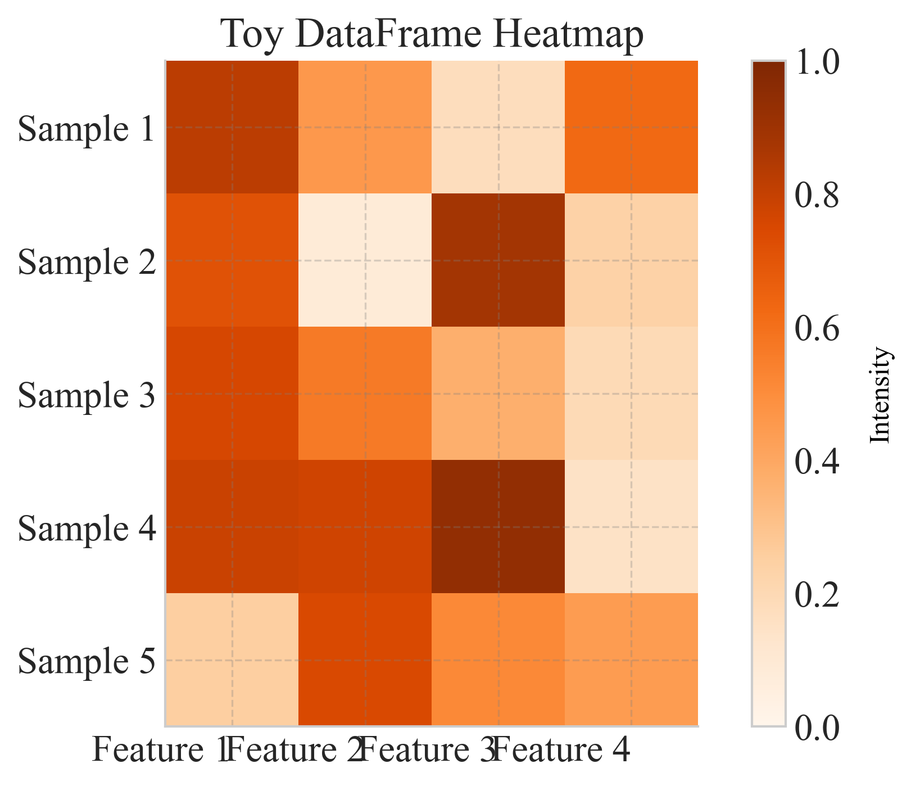
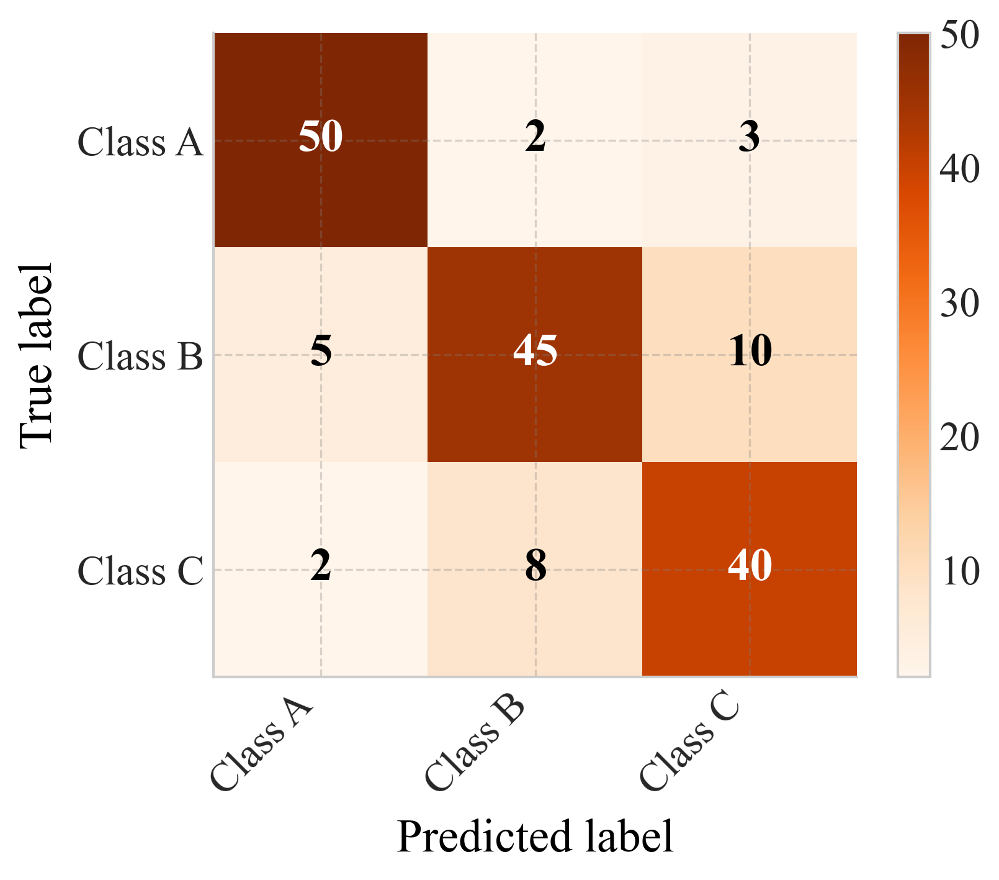
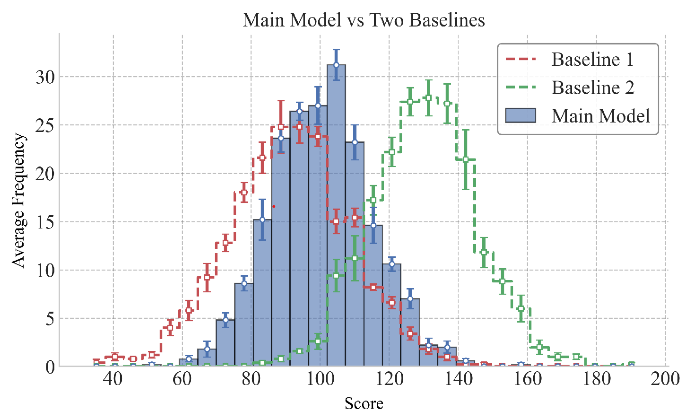

# 📊 Plot Gallery

Browse available plotting functions and their outputs. Click a preview to see full usage and examples.

  

    
  

  <h4 style="margin: 0.5rem 0;"><a href="collection/heatmap.html">heatmap</a></h4>
  
Plot a heatmap of any pandas DataFrame with optional axis labels, annotations, and custom color-scaling.

  

    
  

  <h4 style="margin: 0.5rem 0;"><a href="collection/general_horizontal_bar_plot.html">general_horizontal_bar_plot</a></h4>
  
Horizontal bar plot comparing metrics for each category, with optional group-based coloring and legends.

  

    
  

  <h4 style="margin: 0.5rem 0;"><a href="collection/multiple_std_lines_df.html">multiple_std_lines_df</a></h4>
  
Line plot with shaded confidence intervals and configurable label, color, and linestyle mappings, using a pandas DataFrame in long format.

  

    
  

  <h4 style="margin: 0.5rem 0;"><a href="collection/percentile_curve_plot.html">percentile_curve_plot</a></h4>
  
Plot a curve showing scores ranked by percentile, with optional normalization, vertical/horizontal marker lines, and shaded regions for top scores.

  

    
  

  <h4 style="margin: 0.5rem 0;"><a href="collection/function_percentile_plot.html">function_percentile_plot</a></h4>
  
Plot any function curve across x-values, grouped by a variable (e.g., scale), with percentile annotations and optional formula text.

  

    
  

  <h4 style="margin: 0.5rem 0;"><a href="collection/general_bar_plot.html">general_bar_plot</a></h4>
  
General bar plot comparing multiple metrics for each category with consistent colors and hatching.

  

    
  

  <h4 style="margin: 0.5rem 0;"><a href="collection/confusion_matrix.html">confusion_matrix</a></h4>
  
Plot a confusion matrix heatmap with optional normalization and annotations.

  

    
  

  <h4 style="margin: 0.5rem 0;"><a href="collection/dual_histogram_with_errorbars_df.html">dual_histogram_with_errorbars_df</a></h4>
  
Plot main model and baseline histograms with mean frequencies and standard error bars, using a pandas DataFrame in long format.

  

    
  

  <h4 style="margin: 0.5rem 0;"><a href="collection/embedding_2d_plot.html">embedding_2d_plot</a></h4>
  
Plot a 2D embedding (e.g., t-SNE, PCA, UMAP) colored by categorical groups or continuous values, with optional density contours, legends, and colorbars.

