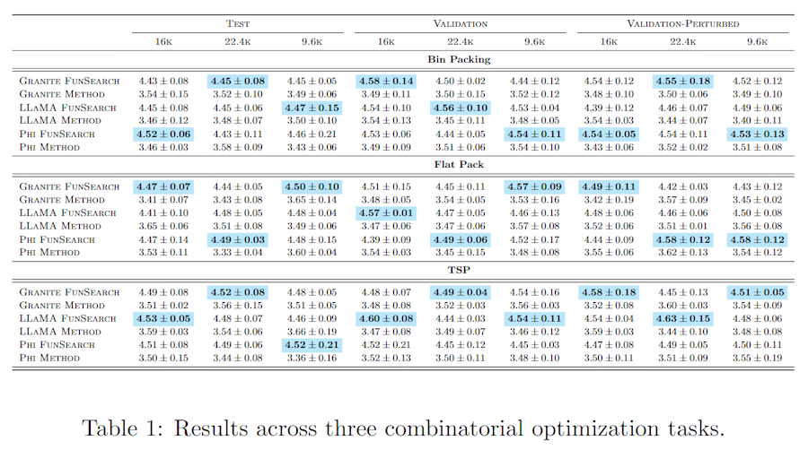

# `grouped_multicol_latex`

> Render a grouped LaTeX table with hierarchical column headers.
> - The DataFrame must contain:
>   - A row label column (e.g., 'Model')
>   - Two columns for column grouping (e.g., 'Split', 'Budget')
>   - A grouping column for row-wise subtables (e.g., 'Task')
>   - A value column, which can be:
>       – a float (e.g., 0.92)
>       – or a list of floats (e.g., [0.91, 0.93, 0.92])
> - Automatically computes mean ± std or stderr
> - Highlights best values (min or max) per column *within each group*
> 

---

## 🧾 Required LaTeX packages / commands

- `\usepackage{booktabs}`
- `\usepackage{scalefnt}`
- `\newcommand{\highlightcolor}[1]{\colorbox[HTML]{bae6fb}{\textbf{#1}}}`


---

## 📥 Arguments

| Name | Type | Required | Description |
|------|------|----------|-------------|
| df | pd.DataFrame | ✅ | DataFrame with row and column metadata + values. Must include all column names passed below. |
| row_index | str | ✅ | Name of the column to use for the leftmost index (e.g., 'Model'). |
| col_index | List[str] | ✅ | Two column names to create multi-level column headers (e.g., ['Split', 'Budget']). |
| groupby | str | ✅ | Column used to group subtables (e.g., 'Task'). |
| value_column | str | ✅ | Column containing scalar or list-like values to format. |
| highlight | str | ❌ | 'min' or 'max' to bold best values per column within each group. |
| stderr | bool | ❌ | Use standard error instead of std deviation. |
| caption | str | ❌ | Optional LaTeX caption added below the table. |
| label | str | ❌ | Optional LaTeX label for referencing. |

---

## 📦 Example Output

````{dropdown} Click to show example code
```python
# Example code for |grouped_multicol_latex| not found.
```
````


