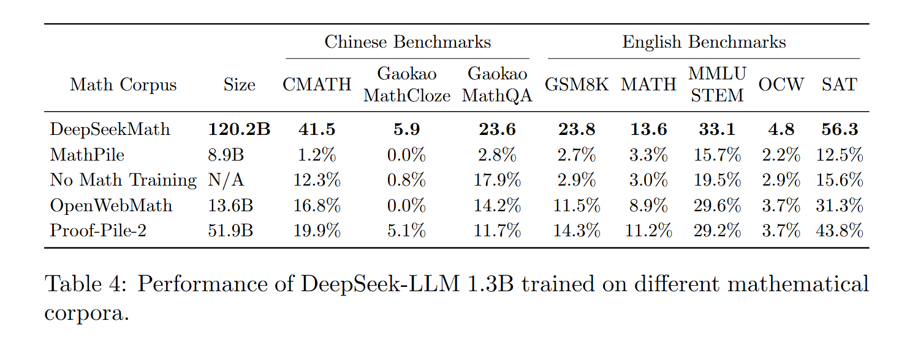

# `multiple_grouped_cols`

> Render a grouped LaTeX table with multi-level column headers.
> - Data is passed in flat format and pivoted internally
> - Row identifiers (e.g. Corpus, Size) are passed via `row_labels`
> - Column grouping and subcolumns (e.g. 'English Benchmarks → GSM8K') inferred from `col_groups` and `col_subgroups`
> - Optionally bold the last row (e.g. final model)
> - Values are auto-formatted as percentages unless already formatted

---

## 🧾 Required LaTeX packages / commands

- `\usepackage{booktabs}`
- `\usepackage{multirow}`
- `\usepackage{adjustbox}\usepackage{makecell}`


---

## 📥 Arguments

| Name | Type | Required | Description |
|------|------|----------|-------------|
| df | pd.DataFrame | ✅ | Flat-format DataFrame with rows like [Corpus, Size, Group, Subtask, Score]. |
| row_labels | List[str] | ✅ | Which columns to use for row identification (e.g. ['Math Corpus', 'Size']). |
| col_groups | str | ✅ | Column name used for the top-level column group (e.g. 'Group'). |
| col_subgroups | str | ✅ | Column name used for the sub-columns within each group (e.g. 'Task'). |
| value_column | str | ✅ | Name of the column containing values to display (e.g. 'Score'). |
| highlight_last_row | bool | ❌ | Whether to bold the last row in the table. |
| caption | str | ❌ | Optional caption to display below the table. |
| label | str | ❌ | Optional LaTeX label for referencing in text. |

---

## 📦 Example Output

````{dropdown} Click to show example code
```python
from swizz import table
import pandas as pd

# Sample data in long format
data = [
    ["No Math Training", "N/A", "English Benchmarks", "GSM8K", 2.9],
    ["No Math Training", "N/A", "English Benchmarks", "MATH", 3.0],
    ["No Math Training", "N/A", "English Benchmarks", "OCW", 2.9],
    ["No Math Training", "N/A", "English Benchmarks", "SAT", 15.6],
    ["No Math Training", "N/A", "English Benchmarks", "MMLU\\\\STEM", 19.5],
    ["No Math Training", "N/A", "Chinese Benchmarks", "CMATH", 12.3],
    ["No Math Training", "N/A", "Chinese Benchmarks", "Gaokao\\\\MathCloze", 0.8],
    ["No Math Training", "N/A", "Chinese Benchmarks", "Gaokao\\\\MathQA", 17.9],

    ["MathPile", "8.9B", "English Benchmarks", "GSM8K", 2.7],
    ["MathPile", "8.9B", "English Benchmarks", "MATH", 3.3],
    ["MathPile", "8.9B", "English Benchmarks", "OCW", 2.2],
    ["MathPile", "8.9B", "English Benchmarks", "SAT", 12.5],
    ["MathPile", "8.9B", "English Benchmarks", "MMLU\\\\STEM", 15.7],
    ["MathPile", "8.9B", "Chinese Benchmarks", "CMATH", 1.2],
    ["MathPile", "8.9B", "Chinese Benchmarks", "Gaokao\\\\MathCloze", 0.0],
    ["MathPile", "8.9B", "Chinese Benchmarks", "Gaokao\\\\MathQA", 2.8],

    ["OpenWebMath", "13.6B", "English Benchmarks", "GSM8K", 11.5],
    ["OpenWebMath", "13.6B", "English Benchmarks", "MATH", 8.9],
    ["OpenWebMath", "13.6B", "English Benchmarks", "OCW", 3.7],
    ["OpenWebMath", "13.6B", "English Benchmarks", "SAT", 31.3],
    ["OpenWebMath", "13.6B", "English Benchmarks", "MMLU\\\\STEM", 29.6],
    ["OpenWebMath", "13.6B", "Chinese Benchmarks", "CMATH", 16.8],
    ["OpenWebMath", "13.6B", "Chinese Benchmarks", "Gaokao\\\\MathCloze", 0.0],
    ["OpenWebMath", "13.6B", "Chinese Benchmarks", "Gaokao\\\\MathQA", 14.2],

    ["Proof-Pile-2", "51.9B", "English Benchmarks", "GSM8K", 14.3],
    ["Proof-Pile-2", "51.9B", "English Benchmarks", "MATH", 11.2],
    ["Proof-Pile-2", "51.9B", "English Benchmarks", "OCW", 3.7],
    ["Proof-Pile-2", "51.9B", "English Benchmarks", "SAT", 43.8],
    ["Proof-Pile-2", "51.9B", "English Benchmarks", "MMLU\\\\STEM", 29.2],
    ["Proof-Pile-2", "51.9B", "Chinese Benchmarks", "CMATH", 19.9],
    ["Proof-Pile-2", "51.9B", "Chinese Benchmarks", "Gaokao\\\\MathCloze", 5.1],
    ["Proof-Pile-2", "51.9B", "Chinese Benchmarks", "Gaokao\\\\MathQA", 11.7],

    ["DeepSeekMath", r"\textbf{120.2B}", "English Benchmarks", "GSM8K", r"\textbf{23.8}"],
    ["DeepSeekMath", r"\textbf{120.2B}", "English Benchmarks", "MATH", r"\textbf{13.6}"],
    ["DeepSeekMath", r"\textbf{120.2B}", "English Benchmarks", "OCW", r"\textbf{4.8}"],
    ["DeepSeekMath", r"\textbf{120.2B}", "English Benchmarks", "SAT", r"\textbf{56.3}"],
    ["DeepSeekMath", r"\textbf{120.2B}", "English Benchmarks", "MMLU\\\\STEM", r"\textbf{33.1}"],
    ["DeepSeekMath", r"\textbf{120.2B}", "Chinese Benchmarks", "CMATH", r"\textbf{41.5}"],
    ["DeepSeekMath", r"\textbf{120.2B}", "Chinese Benchmarks", "Gaokao\\\\MathCloze", r"\textbf{5.9}"],
    ["DeepSeekMath", r"\textbf{120.2B}", "Chinese Benchmarks", "Gaokao\\\\MathQA", r"\textbf{23.6}"]
]

# Create DataFrame
df = pd.DataFrame(data, columns=["Math Corpus", "Size", "Group", "Task", "Score"])

# Render the table
latex = table(
    "multiple_grouped_cols",
    df,
    row_labels=["Math Corpus", "Size"],
    col_group="Group",
    col_subgroup="Task",
    value_column="Score",
    highlight_last_row=False,
    caption="Performance of DeepSeek-LLM 1.3B trained on different mathematical corpora.",
    label="tab:corpora_comparison",
)

print(latex)
```
````


