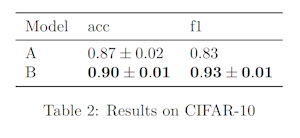

# `simple_df_to_latex`

> Render a simple LaTeX table from a flat DataFrame.
> - First column (e.g., 'Model') is treated as the row label
> - Other columns contain either scalars or list-like values (e.g. [0.82, 0.84, 0.85])
> - Automatically formats values as mean ± std or stderr
> - Optionally highlights best values per column (min or max)

---

## 🧾 Required LaTeX packages / commands

- `\usepackage{booktabs}`


---

## 📥 Arguments

| Name | Type | Required | Description |
|------|------|----------|-------------|
| df | pd.DataFrame | ✅ | DataFrame where the first column is a string label (e.g., 'Model') and other columns are scalars or list-like numeric values. |
| highlight | Dict[str, str] | ❌ | Map of column → 'min' or 'max' to bold the best values. |
| stderr | bool | ❌ | Use standard error (instead of std) for ± formatting. |
| caption | str | ❌ | Optional caption to display below the table. |
| label | str | ❌ | Optional LaTeX label for referencing. |

---

## 📦 Example Output

````{dropdown} Click to show example code
```python
df = pd.DataFrame({
    "Model": ["A", "B"],
    "acc": [[0.85, 0.88, 0.87], [0.90, 0.91, 0.89]],
    "f1": [0.83, [0.92, 0.93]]
})

latex = table(
    "df_to_latex",
    df,
    highlight={"acc": "max", "f1": "max"},
    stderr=False,
    caption="Results on CIFAR-10",
    label="tab:cifar10_results"
)

print(latex)

```
````


