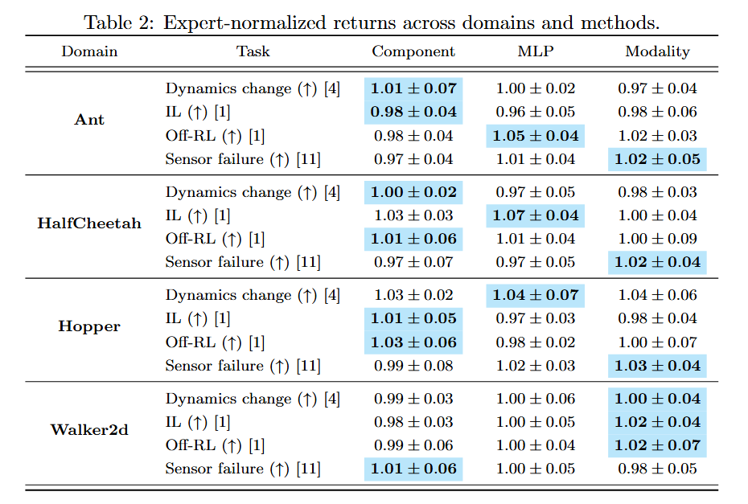

# 🧾 Table Formats

Browse available LaTeX table styles. Click a preview to see full usage, arguments, and output.

  

    
  

  <h4 style="margin: 0.5rem 0;"><a href="collection/grouped_multicol_latex.html">grouped_multicol_latex</a></h4>
  
Render a grouped LaTeX table with hierarchical column headers.

  

    
  

  <h4 style="margin: 0.5rem 0;"><a href="collection/simple_df_to_latex.html">simple_df_to_latex</a></h4>
  
Render a simple LaTeX table from a flat DataFrame.

  

    
  

  <h4 style="margin: 0.5rem 0;"><a href="collection/grouped_multirow_latex.html">grouped_multirow_latex</a></h4>
  
Render a grouped LaTeX table with two-level row headers (e.g., Domain and Task) and flat method columns (e.g., MLP, Modality, Component).

